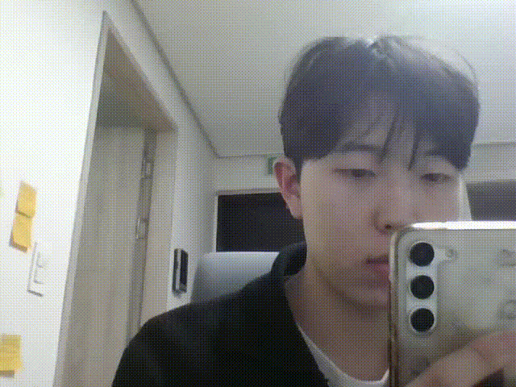
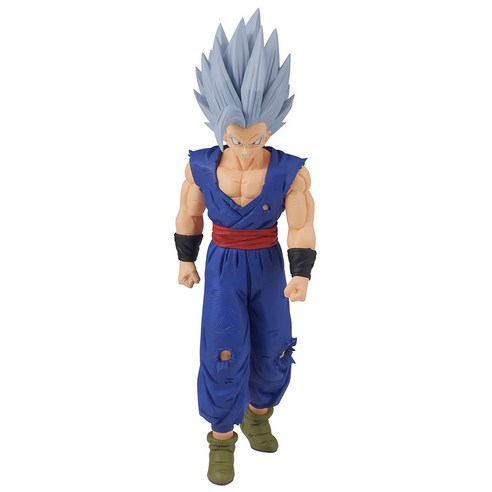
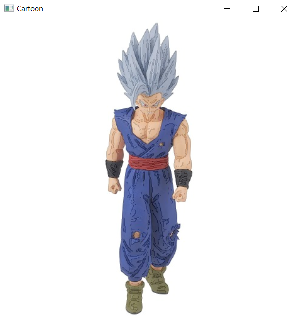

# OpenCV_Project

## 1. Video_Recoder
웹캠을 통화여 녹화를 하는 기본적인 Recoder 프로그램
 
### 기능
1. 스페이스바를 통한 녹화 시작 및 완료
2. 녹화된 파일은 순서대로 Webcam_output_1, Webcam_output_2 ... 의 이름을 가진다.
3. 녹화 중에는 왼쪽 위 빨간 점이 생겨 녹화 여부 인식 가능
4. Tab키를 통해서 좌우 반전 가능
5. ESC를 통해서 프로그램 종료




<br><br><br>


## 2. Simple_CartoonRendering
이미지를 넣으면 간단한 작업을 통해 카툰 랜더링하여 출력

### 기능
이미지의 edge 선을 따서 육안으로는 잘 보이지 않던 옷과 머리의 매무새    
그리고 옷의 구겨진 정도를 강조하여 표현하는 방식으로 카툰 랜더링을 진행한다.

### 한계점
간단한 형태의 피규어 이미지는 이러한 방식의 카툰 랜더링이 잘 먹힌다. ex) 드래곤볼, 주술회전   
하지만 복잡한 형태나 선이 매우 많은 피규어 이미지는 안 그래도 복잡한 형태의 이미지를 더 복잡하게만 만들 뿐 카툰 랜더링의 느낌이 덜하다.





<br><br><br>


## 3. Alphabet_AR
체스판 중앙에 알파벳 A를 3D 형태로 보여주는 AR기능

### 기능
카메라를 캘리브레이션하고 카메라의 자세를 구한다.  
이를 통해서 체스판 코너의 구석을 좌표계로 삼아서 알파벳 A를 AR로 보여주는 영상을 제작한다.

### 한계점 
알파벳 A만 가능하고 아직 다른 것은 불가능하다. 
AR로 구현하는 대상이 어떤 것인지에 따라 고쳐줘야하는 부분이 많다. 이를 자동으로 해결해주는 함수가 필요하다.   


<br><br><br>

## 4. video_subtitle_ocr_translate_tts
자막이 있는 영상을 넣으면 다음의 파일이 생성된다.

#### extract_subtiltes.py
1. 한글 자막을 추출한 json파일    
<br>

#### tanslate_tts.py
1. 한글 자막을 영어로 번역한 json파일
2. TTS로 영어 자막을 읽어주는 WAV파일

<br>

### 사용 패키지


|패키지|버전|설명|
|:-------:|:----:|:----:|
|opencv-python|4.11|자막을 검출할 구역 측정|
|easyocr|1.7.2|자막 검출|
|hanspell|1.1|자막 맞춤법 검사|
| torch | 2.6+ | MT·TTS 백엔드 |
| transformers | 4.42+ | MarianMT 로드 |
| sentencepiece | 0.2x | 토크나이저 |
| TTS | 0.22+ | Coqui-TTS 추론 |
| soundfile | 0.12+ | WAV 저장 |

<br>

#### cmd pip install
```bash
# transformers, soundfile, sentencepiece, TTS, opencv-python, easyocr 
pip install transformers soundfile sentencepiece TTS opencv-python easyocr
```

```bash
# hanspell
pip install git+https://github.com/ssut/py-hanspell.git
```

```bash
# PyTorch, Torchaudio 
pip install --index-url https://download.pytorch.org/whl/cu121 torch==2.7.0+cu121 torchaudio==2.7.0+cu121
```

<br><br>

### 기능

#### extract_subtiltes.py
1. video 파일을 10초 동안 훑어보고 영상 내에서 자막이 주로 나오는 구역을 ROI값으로 구한다.
 
2. 영상 프레임을 2.5초 간격으로 해당 ROI 구역을 확인하고, ocr로 자막을 읽는다.
 
3. 읽은 자막을 네이버+부산대 맞춤법 검사기 API를 이용해 검사를 한다.
 
4. 검사가 완료된 자막을 영상 시간과 함께 json 파일에 저장한다.

#### tanslate_tts.py
1. MarianMT 모델로 subtitles.json을 해석한다.

2. 번역된 파일인 subtitles_en.json를 생성한다.
 
3. TTS를 통해서 subtitles_en.WAV를 생성한다.

<br><br>

## 결과물
```bash
# extract_subtitles.py의 결과물 
# ./input/subtitles.json
  {
    "index": 1,
    "start": "0:00:02,469",
    "end": "0:00:04,938",
    "text": [
      "다름은 가능성이다"
    ]
  },
  {
    "index": 2,
    "start": "0:00:07,407",
    "end": "0:00:09,876",
    "text": [
      "변화와 고집이"
    ]
  },
  {
    "index": 3,
    "start": "0:00:12,345",
    "end": "0:00:14,814",
    "text": [
      "원칙과 피격이"
    ]
  },
```

```bash
# tanslate_tts.py의 결과물
# ./input/subtitles_en.json
  {
    "index": 1,
    "start": "0:00:02,469",
    "end": "0:00:04,938",
    "text": [
      "The difference is a possibility."
    ]
  },
  {
    "index": 2,
    "start": "0:00:07,407",
    "end": "0:00:09,876",
    "text": [
      "Change and stubbornness."
    ]
  },
  {
    "index": 3,
    "start": "0:00:12,345",
    "end": "0:00:14,814",
    "text": [
      "The principle and the assault."
    ]
  },
```

<br>

영어 TTS 데모
./output/subtitles_en.WAV 참고

<br><br>

### 한계점
처음 여러 ocr 패키지를 사용해보았지만 성능이 좋은 ocr(네이버 클로바, 구글 등) 대부분은 API를 횟수당 유로로 제공한다.     
그래서 무료 패키지인 tesseract등을 사용해보았지만 그나마 easyocr이 정확도가 가장높았다.    
그래서 자막을 완벽히 검출의 성능이 떨어져 아쉽다. 이는 번역기도 마찬가지이다.     
한글 자막이 정확해도 번역이 아쉬운 부분들이 있다.

